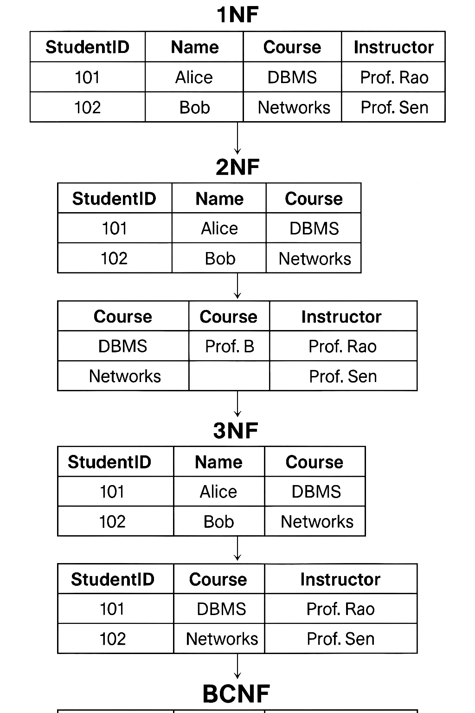

# 🧮 Database Normalization – SQL Concepts

This repository contains an `.xlsx` file and a visual reference for **database normalization** concepts (1NF to BCNF).

---

## 📊 Normalization Diagram

---

## 📘 What is Normalization?

Normalization is a technique to design relational databases by minimizing redundancy and ensuring data integrity. It breaks down large, complex tables into simpler, related ones.

---

## 🔁 Normal Forms Summary

### 1️⃣ First Normal Form (1NF)
- Atomic values only (no arrays or multi-valued columns)
- Remove repeating groups

### 2️⃣ Second Normal Form (2NF)
- Must be in 1NF
- No partial dependency (every non-key column depends on the whole primary key)

### 3️⃣ Third Normal Form (3NF)
- Must be in 2NF
- No transitive dependency (non-key should not depend on another non-key)

### 🧠 BCNF (Boyce-Codd Normal Form)
- Must be in 3NF
- Every determinant must be a candidate key (even stricter)

---

## 💾 File Included

- `normalization-example.xlsx` — Sample tables and schema transformations for normalization practice.

---
